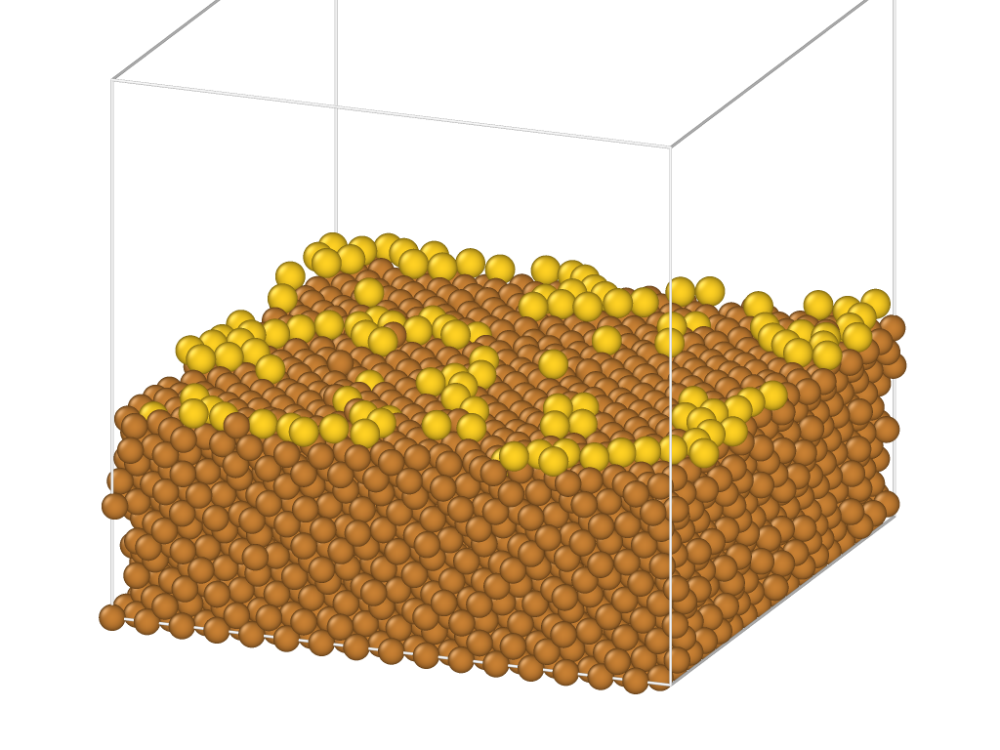

<- [Обратно](../)

При поверхностном заполнении в 25% ML $^2$ (единица монослоя) получались следующие графики для различных температур

Происходило усреднение по 10 расчетам с различными начальными условиями, где усреднение диффузии происходило примерно таким образом:

Итогое значение средней энергии активации для нескольких атомов золота на поверхности меди

Ячейка, в которой происходил расчёт

