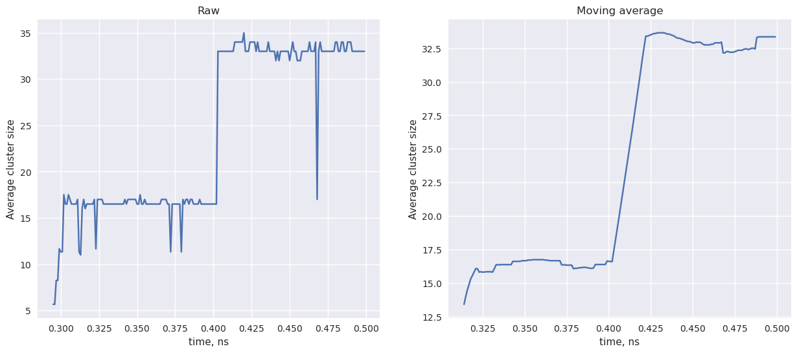
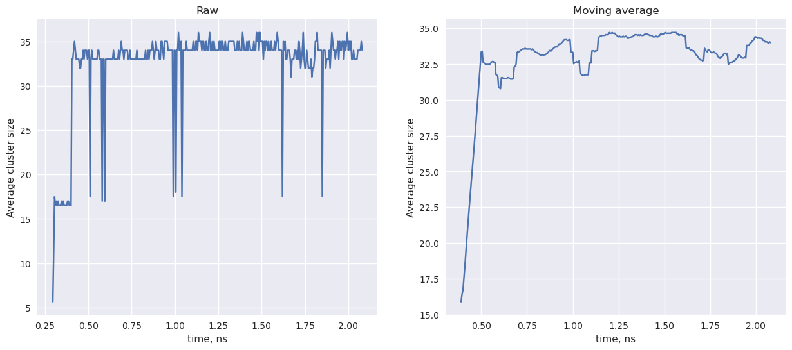

Расчёт происходил в ячейках из порядка 1500 атомов

Процент заполнения 32%             |  Процент заполнения 134%
:-------------------------:|:-------------------------:
  |  

Кластеризация проводилась при помощи DBSCAN с параметром $\varepsilon = 3.61$ с собственной метрикой для реализации периодических граничных условий.

### Золото на меди

На правом графике было применено скользящее среднее

Начало расчёта | Конец расчёта | Пик при 2.3 нc
:-------------------------:|:-------------------------:|:-------------------------:
 |  |

### Золото на золоте

Малый масштаб времени:

Большой масштаб времени:

Начало расчёта | Конец расчёта
:-------------------------:|:-------------------------:
 |  