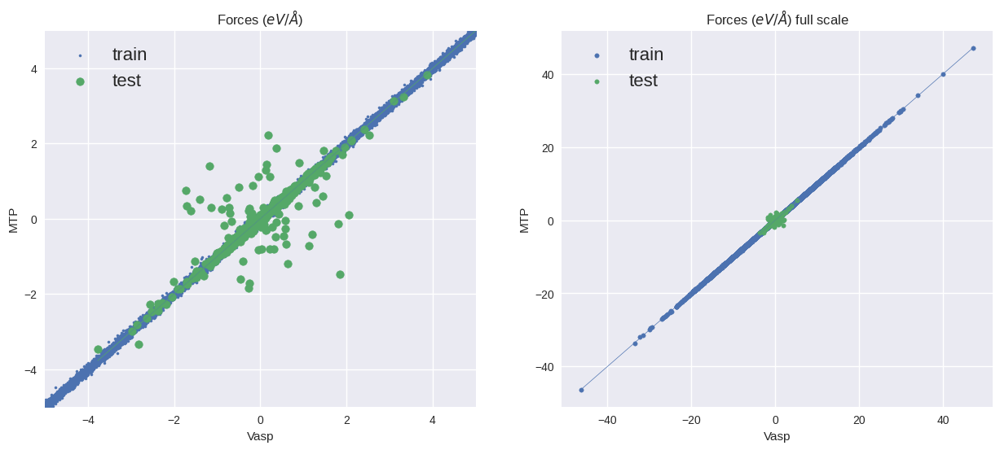

Лог обучения потенциала из MLIP

```
_________________Errors report_________________
Energy:
        Errors checked for 609 configurations
        Maximal absolute difference = 0.710542
        Average absolute difference = 0.100908
        RMS     absolute difference = 0.135047

Energy per atom:
        Errors checked for 609 configurations
        Maximal absolute difference = 0.0150311
        Average absolute difference = 0.00173753
        RMS     absolute difference = 0.00243952

Forces:
        Errors checked for 36570 atoms
        Maximal absolute difference = 0.485561
        Average absolute difference = 0.0638598
        RMS     absolute difference = 0.073904
        Max(ForceDiff) / Max(Force) = 0.00954526
        RMS(ForceDiff) / RMS(Force) = 0.013012
```

Была создана тестовая выборка из 5 конфигураций с грейдами $1.3 \div 1.8 $, отобранные с помощью select-add из конфигураций, полученных в МД.

Графики ошибок предсказаний по силам



Метрики на тестовой выборке:

| RMSE| MAE|
|--|--|
| $0.283 \; eV/ \overset{\circ}{A}$| $0.084 \; eV / \overset{\circ}{A}$|

