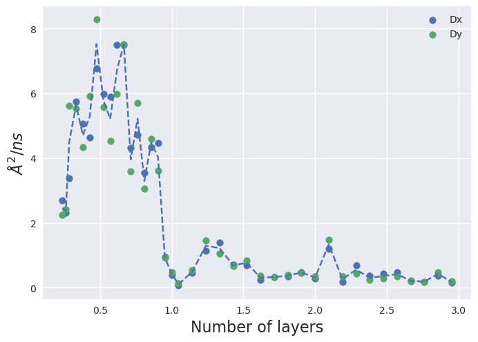
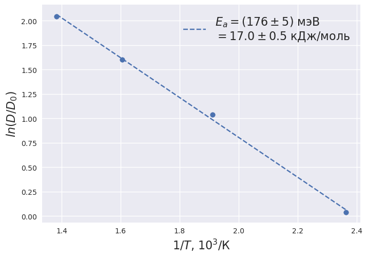
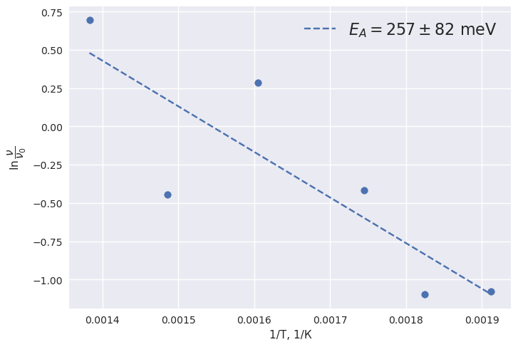
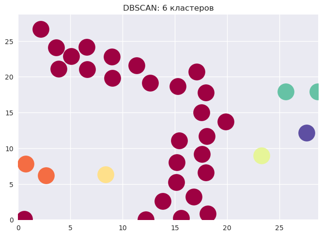
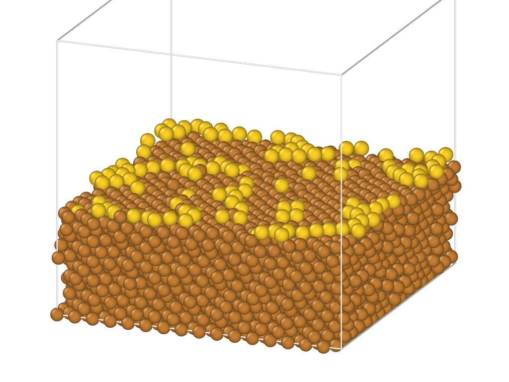

# GoldCVD

| Содержание|  |
|--------------------|----------|
| [Поверхностная диффузия](./SurfaceDiffusion/) |  |
| [Энергия активации (усредненная)](./ActivationEnergy/) |  |
| [Энергия активации (один атом золота по поверхности)](./ActivationEnergy_one_atom/) |  |
| [Кластеризация](./Cluster/) |  |
| [Картинки и анимации](./Images) |  |